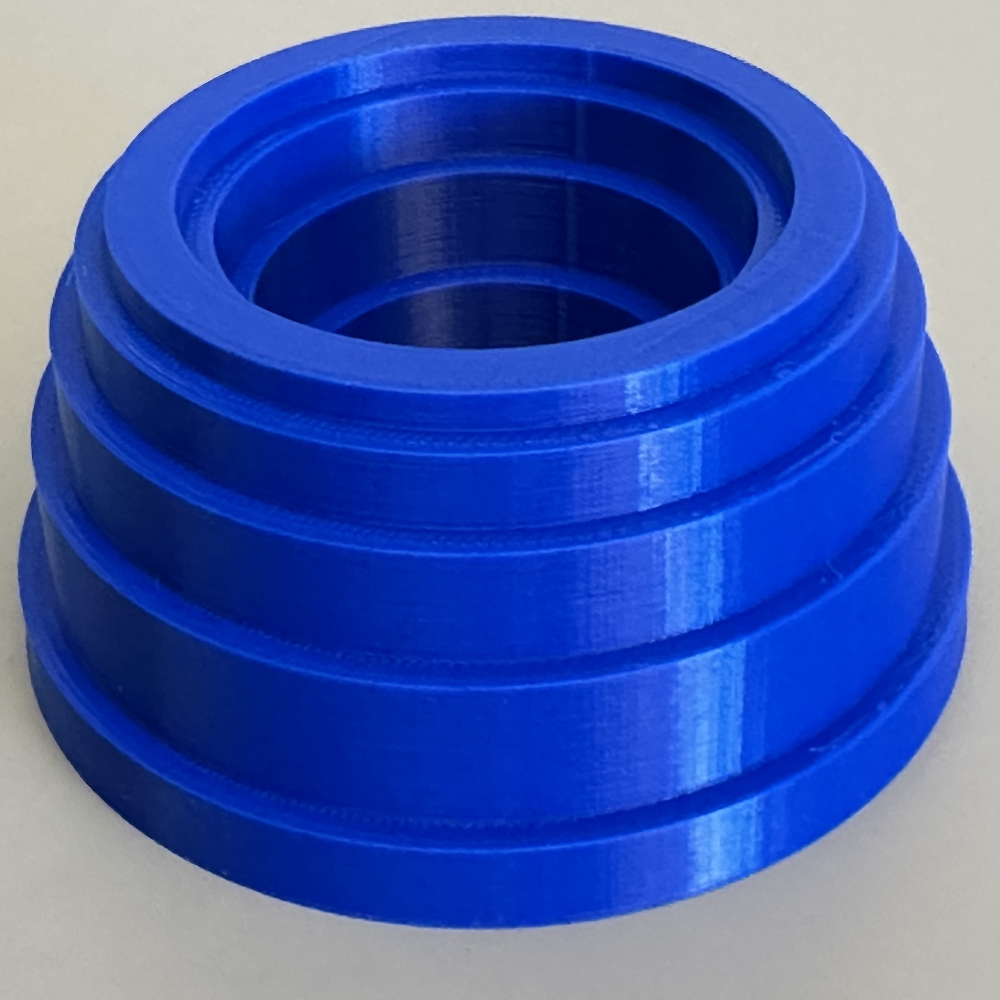

# Calculus 3D Models: Shell Method

This repository contains an OpenSCAD file for illustrating the **shell method** for calculating volumes of revolution, commonly taught in calculus courses.

## Mathematical Description

- The solid is generated by revolving a region between two functions around the **y-axis**:
  - `y = f(x)` defines the **top** of the region.
  - `y = g(x)` defines the **bottom** of the region.
  - `x = a` is the left-hand side of the region.
  - `x = b` is the right-hand side of the region.
- The volume is approximated using **cylindrical shells**, where each shell corresponds to a subinterval sample.
- Alternatively, the exact **solid of revolution** can be rendered using a full surface sweep.

  
  

## Interactive Previews

- [Shell model](Shells.stl) (preview STL file)
- [Solid for the shell model](Solid.stl) (preview STL file)

## How to Use

- Open the `.scad` file in [OpenSCAD](https://openscad.org/).
- Customize parameters:
  - `n`: Number of subintervals
  - `sample_type`: `"left"`, `"mid"`, or `"right"` sampling for approximation
  - `show_solid`: Toggle between stacked cylindrical shells or full continuous solid
  - `printedwidth`: Set the final width (diameter) of the printed object in millimeters
- Render the model.
- Export the model to STL for 3D printing, or use for visualization.

## Files Included

- `Shells.scad` — Main customizable OpenSCAD model with cylindrical shell approximation and full solid modes.
- `Solid.stl` — STL file of the full solid of revolution (smooth continuous surface).
- `Shells.stl` — STL file showing the discrete cylindrical shell approximation.

## License

This project is licensed under the [Creative Commons Attribution-NonCommercial 4.0 International License](https://creativecommons.org/licenses/by-nc/4.0/).  
Feel free to use, modify, and share for educational or personal use, with attribution. Commercial use is not permitted.

